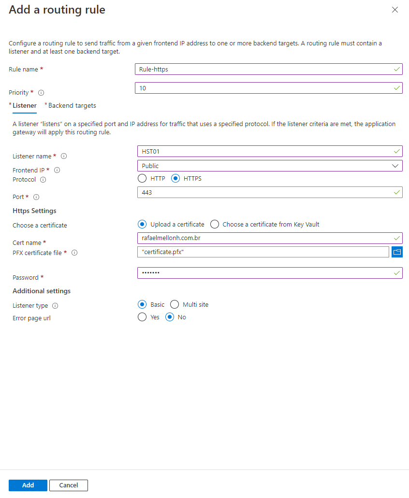
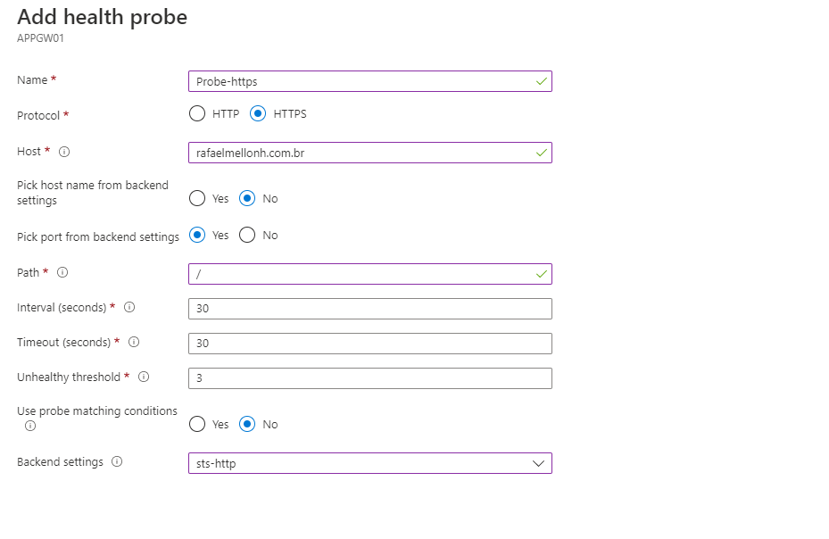

__Criar Application Gateway SSL/TLS Offload__

__Configurar PROBE__

__Instalar IIS nas VMs e configurar o DNS para apontar para o IP do Application Gateway__

__Testar o acesso pelo navegador__

__Criar redirecionamento para o HTTP encaminhar para HTTPS__

É preciso criar um listener para que quando o usuário tente entrar no site por http ele seja encaminhado para https.

__Criar nova Rule para adicionar o Listener adiciona para HTTP__

É preciso configurar dentro da regra para ele redirecionar o acesso para dentro do listener que utiliza HTTPS.

Isso força o uso do HTTPS.

