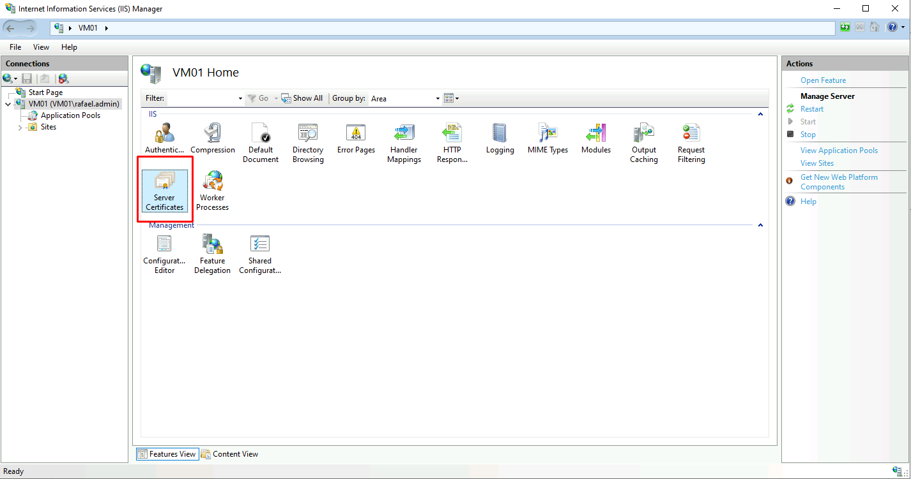
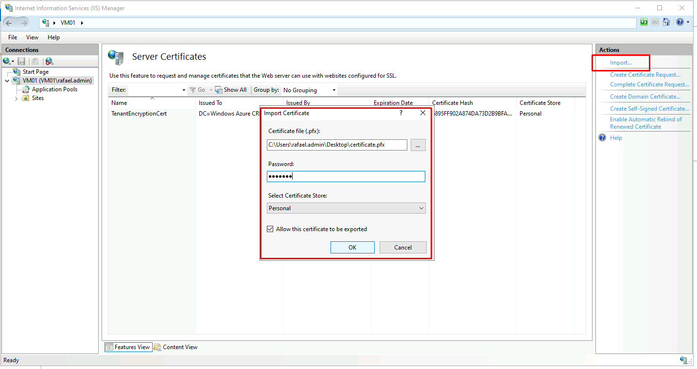
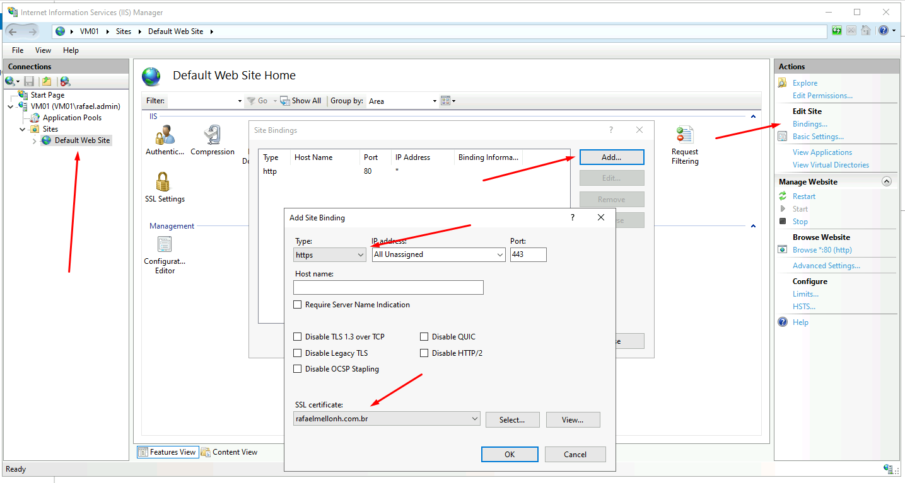

É preciso alterar a regra dentro do Backend settings para HTTPS

O passo a seguir é preciso realizar nos servidores IIS:

Não esquecer de remover a porta 80 no IIS:

Instale o certificado ca_bundle.crt em seu computador para poder exportar o mesmo.

Salve o mesmo em um lugar seguro.

Altere as configurações dentro do Backend Settings.

