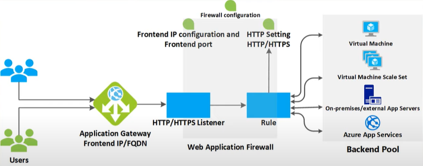
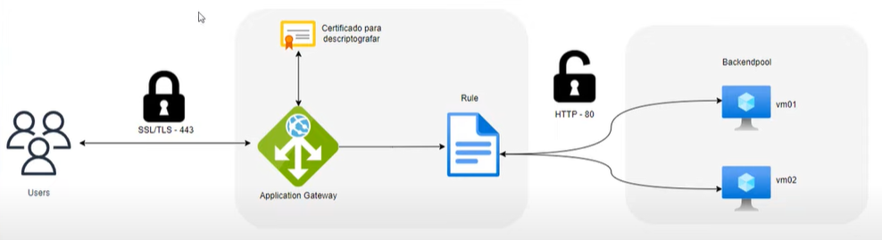
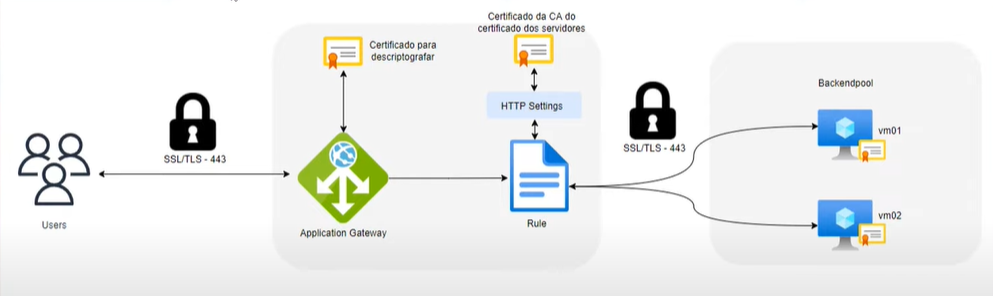

# Azure-Application-Gateway-SSL/TLS Offload-TLS End-to-End

O Application Gateway do Azure é um balanceador de carga que atua na camada 7 do modelo OSI. 
O Application Gateway gerencia as solicitações que os aplicativos cliente enviam aos aplicativos Web hospedados 
em um pool de servidor Web (backend pool)

O pool de servidores Web pode ser composto por máquinas virtuais do Azure, virtual machine scale set (VMSS) do Azure,
App Services do Azure e até mesmo servidores on-premises.

O Application Gateway é um balanceador de carga regional e poder ser utilizado tanto para publicar uma aplicação externa quanto interna.

O Application Gateway fornece recursos de seguranç como Web Application Firewall (WAF), suporte para criptografia TLS/SSL do tráfego entre 
usuários e aplication gateway (SSL/TLS OffLoad), bem como entre os servidores da sua aplicação e o application gateway

# Estrutura do Application Gateway

* Frontend IP
* Listener
* Rules
* HTTP Settings
* Backend Pool

# SSL/TLS Offload

O usuário acesso a aplicação pelo endereço da mesma e quando chegar no Application Gateway, o mesmo irá fazer a descriptografia com o certificado irá encaminhar para a rule e backend sem criptografia e na porta 80, pois já fez o processo de descriptografia e está trafegando "internamente". Após o backend receber o request, ele responde para o Application gateway que irá fazer a criptografia do conteúdo e responder para o usuário já criptografado.

Todo processo de descriptografia e criptografia é realizado pelo Appliction Gateway, assim não sobrecarregando os servidores de backend.

# TLS End-To-End

O processo entre o usuário e o Application Gateway continua o mesmo. Depois de entrar no Application Gateway(descriptografa e criptografa) a requisição é enviada para a regra que tem um HTTP Settings e que "conversa" com o BackendPool na porta 443 utlisando um certificado (certificado esse que pode ser interno). Esse processo é o mais seguro e também consome mais recursos.

Siga para os  [Labs] (https://github.com/rafamellonh/Azure-Application-Gateway-SSL-TLS-Offload-TLS-End-to-End/blob/main/Lab.md)

